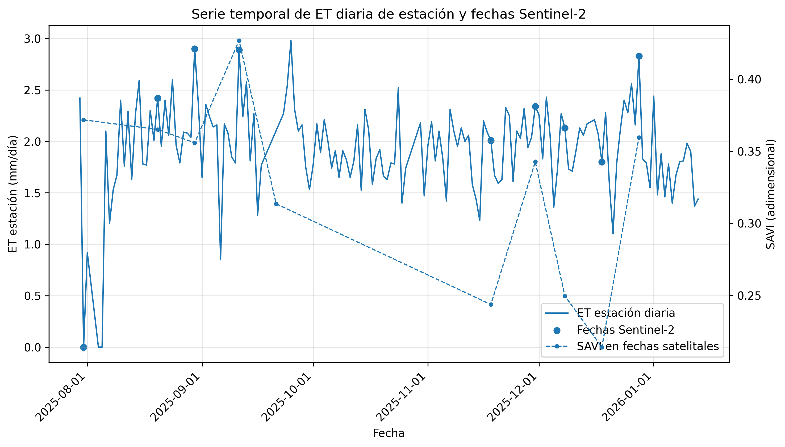
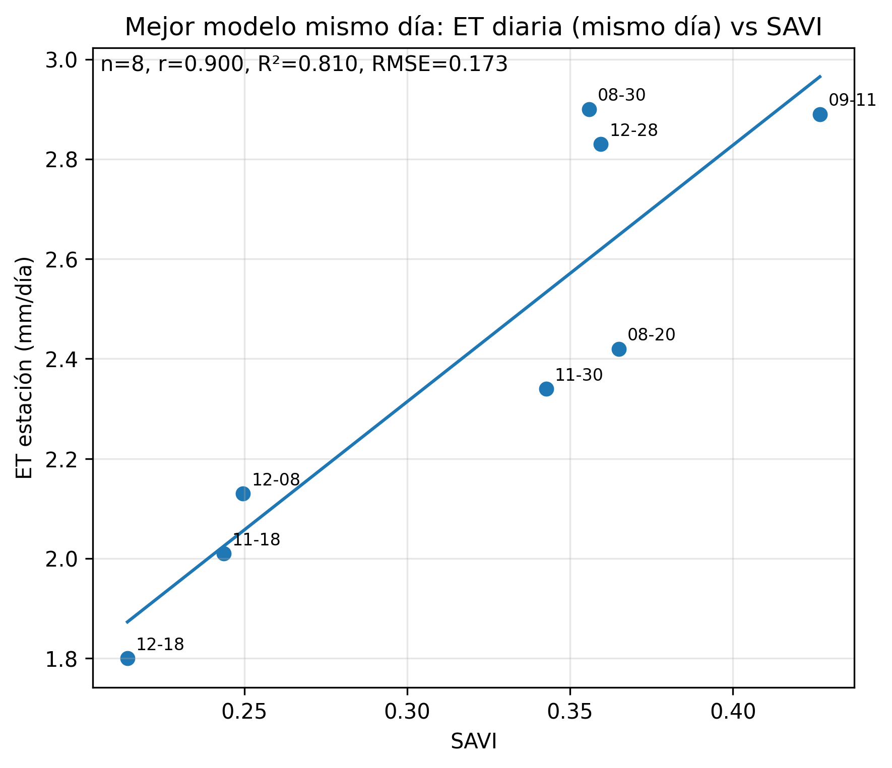
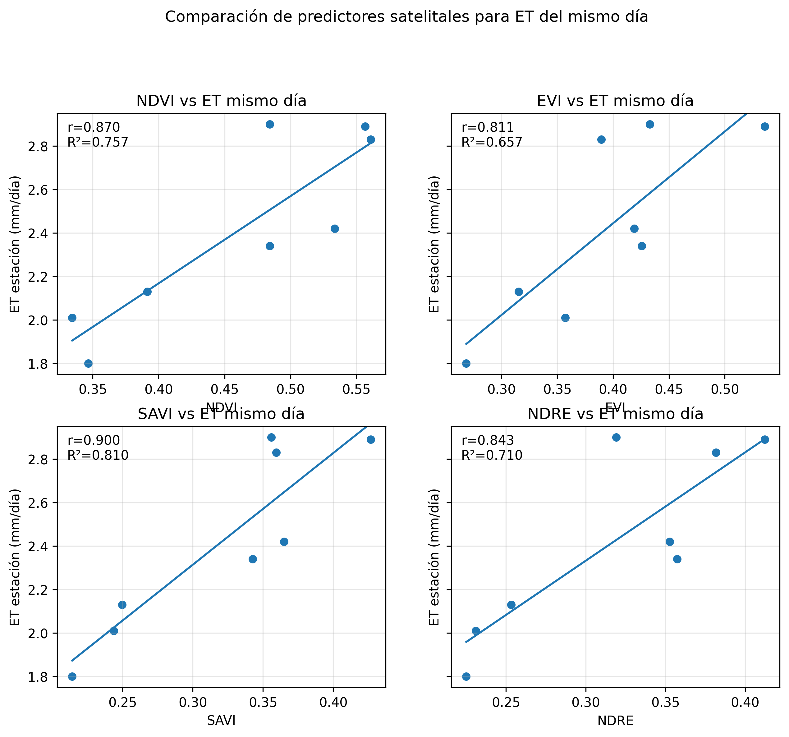
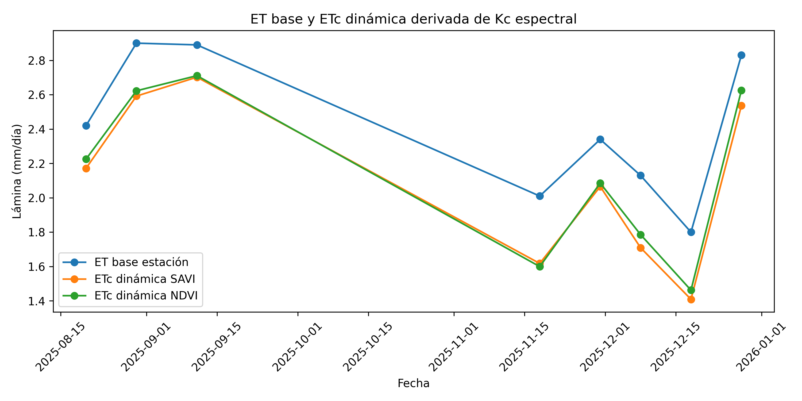
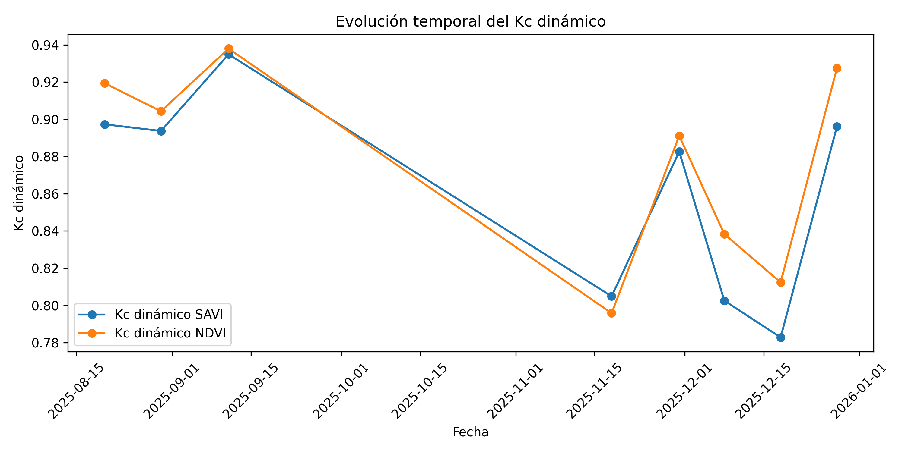
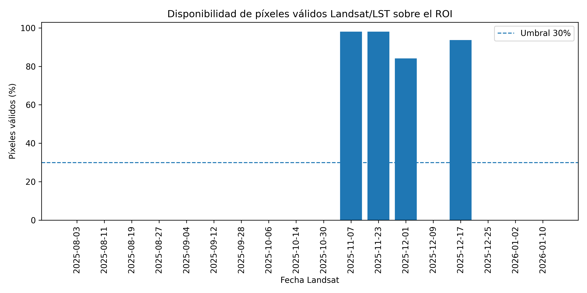
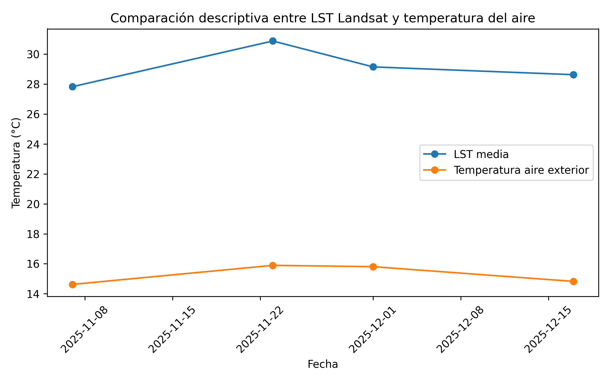

# Resumen

Este trabajo evaluó la integración entre datos meteorológicos de superficie y productos derivados de sensores remotos para construir una aproximación exploratoria de coeficiente de cultivo dinámico (Kc) y evapotranspiración del cultivo espacializada (ETc) en una cobertura de pasturas alrededor de una estación meteorológica. La serie meteorológica fue depurada y corregida temporalmente, obteniendo 158 días diarios entre el 30 de julio de 2025 y el 13 de enero de 2026, de los cuales 143 fueron considerados válidos para análisis. A partir de Sentinel-2 se evaluaron índices espectrales como NDVI, EVI, SAVI y NDRE, y se encontró que SAVI presentó la asociación más fuerte con la ET diaria de estación en el mismo día (n = 8; r = 0.900; R² = 0.810; RMSE = 0.173 mm día^-1^). Posteriormente, se construyó un Kc dinámico exploratorio basado principalmente en SAVI, escalado entre 0.70 y 1.05, y se generó una ETc espacial como el producto entre la ET base de estación y el Kc dinámico. El análisis espacial fue refinado mediante un AOI limpio de pasturas y la exclusión de construcciones y superficies duras, lo cual permitió reducir interferencias espectrales. La rama Landsat/LST se conservó como diagnóstico térmico complementario debido a la baja disponibilidad de escenas válidas (n = 4). Los resultados muestran que el método es viable como aproximación exploratoria y reproducible, aunque su robustez depende de una mayor continuidad de datos meteorológicos y de una mayor disponibilidad de imágenes satelitales válidas.

**Palabras clave:** evapotranspiración, Kc dinámico, Sentinel-2, SAVI, pasturas, estación meteorológica, riego, ETc espacial.

# Introducción

La evapotranspiración es una variable central en la planificación del riego, el balance hídrico agrícola y la interpretación de la demanda de agua de los cultivos. En condiciones operativas, la ET suele estimarse mediante estaciones meteorológicas, modelos de referencia o aproximaciones basadas en variables climáticas. Sin embargo, estas mediciones representan una señal puntual o local, mientras que la variabilidad espacial de la cobertura vegetal puede modificar la demanda hídrica dentro del área de influencia de la estación.

La percepción remota ofrece una alternativa para incorporar información espacial sobre el estado de la vegetación. Índices como NDVI, SAVI, EVI y NDRE permiten aproximar variaciones en vigor, cobertura y respuesta espectral de la superficie. No obstante, estos índices no calculan evapotranspiración por sí mismos; su valor metodológico está en que pueden funcionar como proxies de estado de la cobertura o como insumo para construir coeficientes dinámicos que modulen una ET estimada desde superficie.

En este proyecto se propuso una ruta metodológica para pasar de una señal puntual de estación meteorológica a una representación espacial exploratoria de Kc dinámico y ETc. El enfoque combina tres elementos: una serie meteorológica depurada, imágenes Sentinel-2 válidas y una delimitación espacial refinada del área de pasturas. Adicionalmente, se exploró una rama térmica con Landsat/LST, pero esta se mantuvo como diagnóstico debido a la baja disponibilidad de observaciones válidas.

# Objetivos

## Objetivo general

Evaluar la integración entre datos meteorológicos de superficie y productos derivados de Sentinel-2 para construir una aproximación exploratoria de Kc dinámico y ETc espacial en una cobertura de pasturas alrededor de una estación meteorológica.

## Objetivos específicos

1. Depurar y estructurar la serie meteorológica diaria de la estación, garantizando coherencia temporal y criterios mínimos de calidad.
2. Evaluar la relación entre la ET diaria de estación y proxies espectrales derivados de Sentinel-2.
3. Construir un Kc dinámico exploratorio a partir de índices espectrales, usando SAVI como índice principal y NDVI como comparación.
4. Generar mapas de ETc espacial como producto entre la ET base de estación y el Kc dinámico.
5. Refinar la unidad espacial de análisis mediante un AOI limpio de pasturas y la exclusión de construcciones o superficies duras.
6. Diagnosticar la viabilidad de una rama térmica Landsat/LST como complemento metodológico.

# Área de estudio

El estudio se desarrolló en el entorno de una estación meteorológica ubicada en la Universidad Nacional de Colombia, sede Bogotá. La unidad espacial inicial fue un buffer de 300 m alrededor de la estación. Posteriormente, este entorno fue refinado mediante la delimitación de un AOI de pasturas y la exclusión de construcciones, techos, vías y superficies duras que podían generar interferencia espectral.

{#fig-localizacion width=90%}

El refinamiento espacial fue una decisión metodológica central. El análisis inicial sobre el buffer completo incluía zonas construidas y superficies no vegetadas. Al excluir estas áreas, las estadísticas de Kc y ETc se hicieron más representativas de la cobertura de pasturas, que era la cobertura de interés para la relación estación–satélite.

{#fig-aoi width=90%}

# Datos y metodología

## Datos meteorológicos

La estación meteorológica registró información con resolución nominal de 5 minutos. Durante la depuración se corrigió un problema crítico de interpretación de fechas, en el cual fechas en formato ISO podían ser leídas con inversión de mes y día. Tras la corrección, la serie diaria quedó comprendida entre el 30 de julio de 2025 y el 13 de enero de 2026.

La variable de referencia fue la ET diaria exterior reportada por la estación. Esta ET se interpretó como una referencia operativa modelada por el sistema de estación, no como una medición directa de ET real. Se usaron criterios de calidad diaria para conservar únicamente días con cobertura suficiente de registros y variables meteorológicas consistentes.

**Resumen de estación meteorológica:**

| Indicador | Valor |
|---|---:|
| Rango temporal | 2025-07-30 a 2026-01-13 |
| Días diarios disponibles | 158 |
| Días válidos para análisis | 143 |
| ET media exterior | 1.925 mm día^-1^ |
| Temperatura exterior media | 14.988 °C |
| Radiación exterior media | 117.073 |

## Procesamiento Sentinel-2

Se extrajeron imágenes Sentinel-2 sobre el área de estudio y se calcularon índices espectrales: NDVI, EVI, SAVI y NDRE. Posteriormente, se cruzaron las fechas satelitales válidas con días meteorológicos válidos de estación. El cruce final Sentinel–estación produjo 8 observaciones analysis-ready entre el 20 de agosto y el 28 de diciembre de 2025.

La relación entre la ET diaria de estación y los índices espectrales se evaluó mediante regresiones lineales simples y correlaciones de Pearson y Spearman. Dado el tamaño muestral reducido, los resultados se interpretaron como exploratorios y se complementaron con análisis de robustez: leave-one-out, bootstrap y prueba de permutación.

{#fig-timeline width=90%}

## Construcción del Kc dinámico

El Kc dinámico se construyó como un coeficiente exploratorio relativo, escalado dentro del rango observado de cada índice en las fechas Sentinel-2 válidas. Se usó SAVI como índice principal debido a su mejor desempeño en la relación con ET diaria de estación. NDVI se conservó como comparación metodológica.

La formulación general fue:

$$
Kc_{dinámico} = Kc_{min} + \left( \frac{VI - VI_{min}}{VI_{max} - VI_{min}} \right)(Kc_{max} - Kc_{min})
$$

Donde $VI$ corresponde al índice espectral seleccionado. Para este proyecto se asumieron los siguientes límites exploratorios:

$$
Kc_{min} = 0.70
$$

$$
Kc_{max} = 1.05
$$

La ETc espacial se calculó como:

$$
ETc_{SAVI} = ET_{base\ estación} \times Kc_{SAVI\ dinámico}
$$

Este producto no corresponde a una medición directa de ET real ni a una estimación satelital física independiente. Su aporte principal es espacializar la ET de estación en función del vigor o cobertura vegetal observada por Sentinel-2.

## Enmascaramiento espacial y AOI limpio

Los rasters de Kc/ETc fueron exportados desde Google Earth Engine y posteriormente enmascarados en QGIS/Python usando un AOI limpio de pasturas. Se excluyeron construcciones y superficies duras digitalizadas manualmente. Esta etapa permitió reducir la mezcla espectral dentro del buffer original y mejorar la representatividad agronómica del Kc.

## Diagnóstico Landsat/LST

Además de Sentinel-2, se procesó una rama térmica con Landsat 8/9 LST. Esta variable se consideró conceptualmente relevante por su cercanía al balance energético superficial. Sin embargo, la disponibilidad de escenas válidas fue baja debido a nubosidad, sombras y enmascaramiento QA. Por esta razón, Landsat/LST se conservó como diagnóstico térmico complementario y no se utilizó para ajustar regresiones robustas.

# Resultados

## Relación entre ET de estación y proxies Sentinel-2

El mejor modelo para ET diaria del mismo día fue el modelo con SAVI como predictor:

$$
ET = 0.773 + 5.137 \times SAVI
$$

**Desempeño del modelo principal:**

| Métrica | Valor |
|---|---:|
| n | 8 |
| Pearson r | 0.900 |
| Spearman rho | 0.833 |
| R² | 0.810 |
| RMSE | 0.173 mm día^-1^ |
| MAE | 0.146 mm día^-1^ |
| Pendiente | 5.137 |
| Intercepto | 0.773 |

{#fig-savi width=80%}

El ranking de predictores para ET diaria del mismo día mostró que SAVI fue el índice de mejor desempeño, seguido de NDVI, NDRE y EVI.

| Predictor | r | R² | RMSE |
|---|---:|---:|---:|
| SAVI | 0.900 | 0.810 | 0.173 |
| NDVI | 0.870 | 0.757 | 0.196 |
| NDRE | 0.843 | 0.710 | 0.214 |
| EVI | 0.811 | 0.657 | 0.233 |

{#fig-predictores width=90%}

Los análisis de robustez mostraron que la señal principal no dependió de una única observación. En leave-one-out, R² varió entre 0.722 y 0.866, mientras que la prueba de permutación presentó un valor p empírico bilateral de 0.005699. Estos resultados respaldan la existencia de una asociación exploratoria entre SAVI y la ET diaria de estación, aunque el tamaño muestral sigue siendo reducido.

## Kc dinámico y ETc espacial en buffer inicial

Antes del enmascaramiento por AOI limpio, el Kc dinámico basado en SAVI presentó un valor medio de 0.862, con un rango temporal entre 0.783 y 0.935. La ETc basada en SAVI tuvo una media de 2.100 mm día^-1^, con valores entre 1.409 y 2.702 mm día^-1^. En promedio, la ETc SAVI representó el 86.19 % de la ET base de estación.

Estos valores fueron útiles como primera aproximación, pero el buffer original contenía construcciones y superficies no vegetadas. Por esta razón, el resultado final se reporta principalmente sobre el AOI limpio de pasturas.

## Kc dinámico y ETc espacial en AOI limpio de pasturas

Tras excluir construcciones y superficies duras, el Kc dinámico basado en SAVI aumentó en varias fechas, lo que confirma que el buffer inicial mezclaba coberturas no vegetadas con la cobertura de pasturas. La siguiente tabla resume las fechas seleccionadas para la composición multitemporal.

| Fecha | Kc SAVI limpio | ETc SAVI limpia (mm día^-1^) | Interpretación |
|---|---:|---:|---|
| 2025-09-11 | 0.986 | 2.851 | Mayor vigor/cobertura relativa y ETc alta |
| 2025-11-18 | 0.857 | 1.722 | Descenso intermedio de Kc y ETc |
| 2025-12-18 | 0.819 | 1.475 | Menor Kc y menor ETc de la serie seleccionada |
| 2025-12-28 | 0.969 | 2.742 | Recuperación del Kc y ETc alta |

La composición multitemporal del Kc muestra cambios espaciales y temporales en el vigor/cobertura vegetal del AOI limpio. La escala fue mantenida constante entre paneles para permitir comparación directa.

{#fig-kc-multi width=100%}

La composición de ETc espacial muestra la lámina diaria resultante de multiplicar la ET base de estación por el Kc dinámico SAVI. Los cambios entre fechas reflejan tanto la variabilidad meteorológica de la ET de estación como la modulación espacial asociada al estado de la cobertura vegetal.

{#fig-etc-multi width=100%}

## Comparación temporal de ET base, Kc y ETc

La ETc dinámica mantiene una alta relación con la ET base, lo cual es esperable por construcción matemática, ya que ETc se calculó como el producto entre ET base y Kc. Por esta razón, la interpretación principal no debe centrarse en la correlación ET base–ETc, sino en la capacidad del Kc de introducir variabilidad espacial y temporal asociada al estado de la cobertura.

{#fig-etc-serie width=90%}

{#fig-kc-serie width=90%}

## Diagnóstico Landsat/LST

La rama Landsat/LST produjo 18 escenas sobre el ROI, de las cuales solo 4 fueron válidas después del enmascaramiento de calidad. Las cuatro fechas analysis-ready se ubicaron entre el 7 de noviembre y el 17 de diciembre de 2025. La mediana del porcentaje de píxeles válidos fue 0 %, lo que evidencia una limitación fuerte por nubosidad, sombras o enmascaramiento QA.

| Indicador | Valor |
|---|---:|
| Escenas Landsat ROI | 18 |
| Escenas válidas | 4 |
| Fechas analysis-ready | 4 |
| Rango analysis-ready | 2025-11-07 a 2025-12-17 |
| LST media en fechas válidas | 29.125 °C |
| Temperatura media exterior | 15.287 °C |
| Diferencia LST - T aire | 13.837 °C |

Dado el número reducido de coincidencias válidas, Landsat/LST no se usó para inferencia estadística. Su aporte fue diagnóstico y metodológico.

{#fig-landsat-valid width=90%}

{#fig-landsat-tair width=90%}

# Discusión

## Viabilidad del método

Los resultados muestran que el método es viable para construir una aproximación espacial de Kc dinámico y ETc a partir de la integración entre estación meteorológica y Sentinel-2. El flujo permitió pasar de una señal puntual de ET de estación a superficies espaciales de Kc y ETc, usando índices espectrales como moduladores del estado de la cobertura vegetal.

El resultado más consistente fue la relación entre ET diaria y SAVI. Esto justificó usar SAVI como índice principal para el Kc dinámico. No obstante, NDVI presentó resultados similares y se mantuvo como comparación metodológica. La alta consistencia entre Kc SAVI y Kc NDVI sugiere que ambos índices capturan patrones similares de cobertura, aunque SAVI tuvo mejor desempeño empírico frente a la ET diaria de estación.

## Importancia del AOI limpio

La comparación entre el buffer inicial y el AOI limpio evidenció que la delimitación espacial es una decisión crítica. En un entorno urbano-universitario, un buffer circular puede incluir techos, vías, invernaderos y superficies duras. Estas coberturas no representan la superficie agrícola de interés y pueden alterar las estadísticas espectrales. La exclusión de construcciones permitió obtener un Kc más coherente con la cobertura de pasturas.

## Limitaciones por disponibilidad de datos

La principal limitación del estudio fue el tamaño muestral. Aunque la estación tuvo 143 días válidos, el número de fechas analysis-ready se redujo al exigir coincidencia con imágenes Sentinel-2 válidas y días meteorológicos completos. Además, las imágenes satelitales fueron afectadas por nubosidad, sombras, enmascaramiento de píxeles y disponibilidad temporal.

El método depende críticamente de dos condiciones: la disponibilidad de imágenes satelitales válidas y la calidad/continuidad de las mediciones de la estación meteorológica. Durante el procesamiento se excluyeron numerosas observaciones por falta de coincidencia temporal, baja calidad satelital o días meteorológicos no válidos. Por tanto, se recomienda ampliar la serie temporal de la estación, fortalecer el control de calidad de los sensores y mantener un registro continuo que permita incrementar el número de fechas analysis-ready.

## Alcance de la ETc espacial

La ETc espacial generada en este trabajo no debe interpretarse como una medición directa de ET real ni como una estimación satelital física independiente. Es una espacialización exploratoria de la ET de estación modulada por un Kc dinámico basado en el estado espectral de la cobertura vegetal. Su utilidad está en representar heterogeneidad espacial relativa y ofrecer una ruta metodológica reproducible para apoyar decisiones de riego.

# Conclusiones

1. La depuración temporal de la estación meteorológica fue fundamental para garantizar la coherencia del análisis. Después de corregir el parseo de fechas, la serie diaria quedó entre el 30 de julio de 2025 y el 13 de enero de 2026, con 143 días válidos.

2. Sentinel-2 permitió construir una relación exploratoria entre ET diaria de estación y proxies espectrales. SAVI fue el predictor con mejor desempeño para ET diaria del mismo día, con r = 0.900 y R² = 0.810.

3. Se construyó un Kc dinámico exploratorio basado en SAVI, escalado entre 0.70 y 1.05. Este Kc permitió espacializar la ET de estación y generar mapas de ETc en mm día^-1^.

4. La delimitación del AOI limpio de pasturas y la exclusión de construcciones mejoraron la representatividad espacial del Kc dinámico. Este paso fue clave para reducir mezcla espectral y enfocar el análisis en la cobertura vegetal de interés.

5. La rama Landsat/LST fue metodológicamente relevante, pero la disponibilidad efectiva de observaciones fue insuficiente para ajustar regresiones robustas. Por tanto, se mantuvo como diagnóstico térmico complementario.

6. La metodología es viable y reproducible, pero requiere una serie temporal meteorológica más amplia y una mayor disponibilidad de imágenes satelitales válidas para pasar de una aproximación exploratoria a una validación robusta.

# Recomendaciones

- Ampliar la serie temporal de la estación meteorológica para cubrir más ciclos climáticos y aumentar el número de coincidencias con Sentinel-2.
- Fortalecer el control de calidad de sensores y registros meteorológicos, especialmente en variables asociadas a ET.
- Mantener el uso de AOI limpios de cobertura vegetal y evitar promedios sobre buffers que incluyan construcciones o superficies duras.
- Evaluar el método en otras coberturas o cultivos para explorar la transferencia de la metodología.
- Incorporar mediciones independientes de ET real, como lisímetro o balance hídrico controlado, para validar el Kc dinámico y la ETc espacial.

# Referencias

Allen, R. G., Pereira, L. S., Raes, D., & Smith, M. (1998). *Crop evapotranspiration: Guidelines for computing crop water requirements*. FAO Irrigation and Drainage Paper 56.

Bastiaanssen, W. G. M., Menenti, M., Feddes, R. A., & Holtslag, A. A. M. (1998). A remote sensing surface energy balance algorithm for land (SEBAL): Part 1. Formulation. *Journal of Hydrology*, 212–213, 198–212.

Glenn, E. P., Huete, A. R., Nagler, P. L., & Nelson, S. G. (2008). Relationship between remotely-sensed vegetation indices, canopy attributes and plant physiological processes: What vegetation indices can and cannot tell us about the landscape. *Sensors*, 8(4), 2136–2160.

Senay, G. B., Bohms, S., Singh, R. K., Gowda, P. H., Velpuri, N. M., Alemu, H., & Verdin, J. P. (2013). Operational evapotranspiration mapping using remote sensing and weather datasets: A new parameterization for the SSEB approach. *Journal of the American Water Resources Association*, 49(3), 577–591.

Stanghellini, C. (1987). *Transpiration of greenhouse crops: An aid to climate management*. Agricultural University Wageningen.

