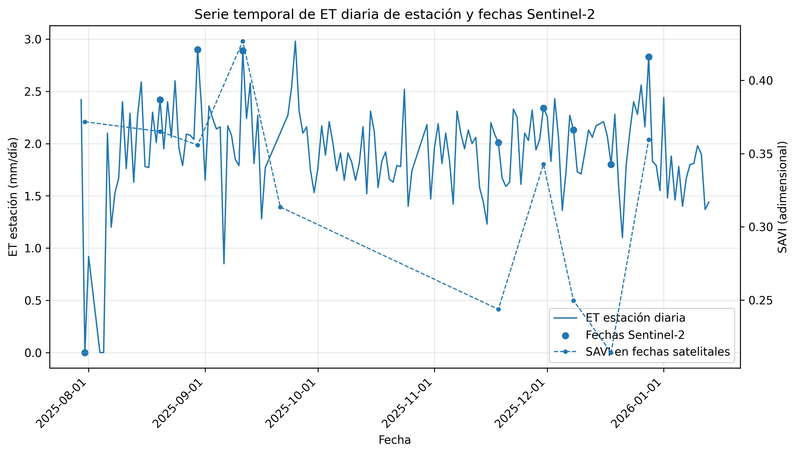
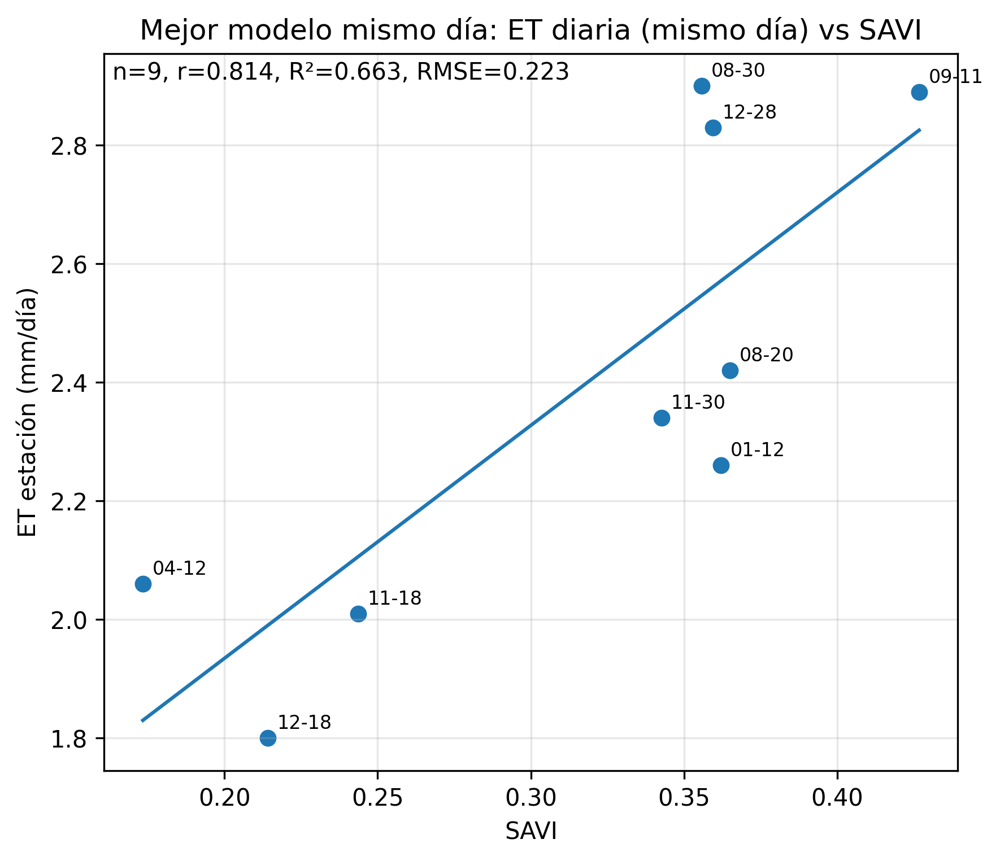
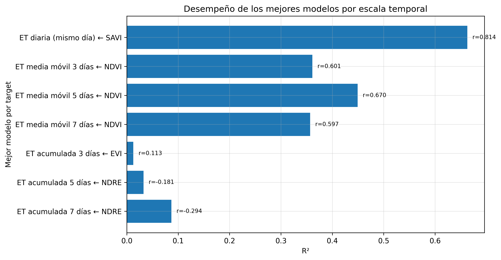
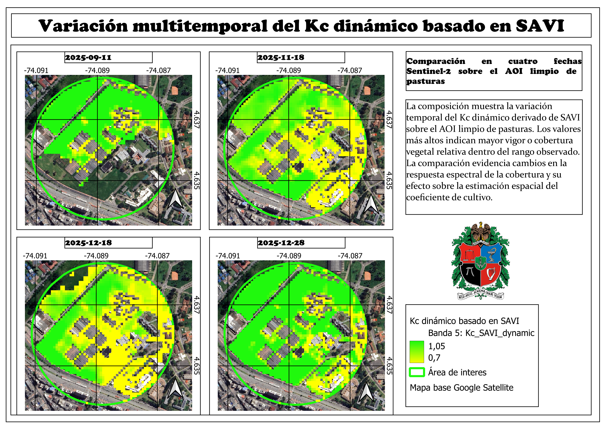
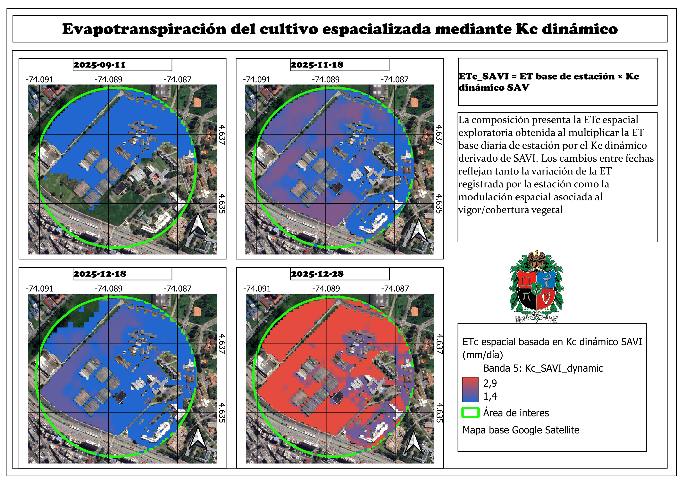

# Resumen

La evapotranspiración del cultivo (ETc) es una variable central para estimar demanda hídrica y apoyar la programación del riego. Sin embargo, en muchos ejercicios prácticos de riego la información meteorológica se obtiene desde una estación puntual, mientras que el cultivo y la cobertura vegetal presentan variabilidad espacial. Esta diferencia entre medición puntual y superficie de manejo crea una limitación operativa: una estación permite estimar la demanda atmosférica, pero no describe por sí sola cómo cambia la respuesta de la cobertura dentro del área de estudio. En este contexto, el presente trabajo desarrolló un flujo metodológico exploratorio para espacializar la ETc en una cobertura de pasturas mediante la integración de una estación meteorológica, índices espectrales Sentinel-2 y un coeficiente de cultivo dinámico (Kc) derivado del estado espectral de la vegetación.

El estudio se estructuró como un proyecto práctico reproducible. Primero se depuró la estación meteorológica y se consolidó una serie diaria de 158 días, de los cuales 143 fueron válidos para análisis. Luego se procesaron imágenes Sentinel-2 y se calcularon índices espectrales como NDVI, SAVI, EVI y NDRE. El cruce estación--satélite permitió obtener ocho fechas *analysis-ready*. Con esas fechas se evaluaron relaciones simples entre la ET diaria de estación y los índices espectrales. SAVI fue el mejor predictor de la ET diaria, con $R^2 = 0.810$, $r = 0.900$ y RMSE = 0.173 mm día$^{-1}$. A partir del rango observado de SAVI se construyó un Kc dinámico exploratorio, escalado entre 0.70 y 1.05, y posteriormente se calculó la ETc espacial como el producto entre la ET base diaria de estación y el Kc dinámico.

En el AOI limpio de pasturas, el Kc medio basado en SAVI varió entre 0.819 y 0.986, mientras que la ETc media espacial varió entre 1.475 y 2.851 mm día$^{-1}$ en las fechas seleccionadas. Landsat/LST se evaluó como complemento térmico, pero su baja disponibilidad efectiva (4 escenas válidas de 18) restringió su uso a un diagnóstico descriptivo. El principal aporte del ejercicio no consiste en afirmar una medición directa de ET real desde satélite, sino en demostrar una ruta reproducible para transformar una señal meteorológica puntual en mapas exploratorios de demanda hídrica relativa. La metodología puede apoyar decisiones de riego al identificar zonas con distinta demanda relativa, aunque requiere ampliar la serie temporal, mejorar la validación de campo e integrar sensores adicionales para avanzar hacia una aplicación operativa robusta.

**Palabras clave:** evapotranspiración del cultivo; Kc dinámico; ETc espacial; Sentinel-2; SAVI; riego; sensores remotos; pasturas; agricultura de precisión.


# Introducción

La programación del riego depende de la capacidad de estimar cuánta agua demanda el sistema suelo--planta--atmósfera. En la teoría clásica de riego, la evapotranspiración integra la evaporación desde el suelo y la transpiración de la planta, por lo que representa una de las salidas principales del balance hídrico agrícola [@Allen1998FAO56; @Pereira2015FAO56]. Desde el punto de vista ingenieril, estimar ET y ETc permite aproximar necesidades de riego, ajustar frecuencias de aplicación, comparar escenarios de manejo y evaluar el comportamiento de una cobertura bajo condiciones meteorológicas específicas [@Penman1948; @Monteith1965; @Allen1998FAO56].

El enfoque FAO-56 consolidó el uso de la evapotranspiración de referencia (ETo) y de coeficientes de cultivo (Kc) para estimar la evapotranspiración del cultivo mediante la relación general $ET_c = ET_o \times K_c$ [@Allen1998FAO56]. Este marco sigue siendo ampliamente usado porque separa la demanda atmosférica, representada por ETo, de la respuesta particular del cultivo, representada por Kc [@Pereira2015FAO56]. Sin embargo, en condiciones reales de campo, el Kc no es necesariamente constante en el espacio: depende del estado fenológico, cobertura, densidad vegetal, humedad, suelo, manejo y heterogeneidad del lote [@Glenn2011KcVI; @Kamble2013Kc; @Poczas2015Kc].

Una estación meteorológica permite calcular o aproximar la demanda atmosférica en una localización concreta, pero no describe por sí misma la variabilidad espacial del cultivo. Esta limitación es especialmente importante en proyectos de riego, donde las decisiones se aplican sobre superficies y no únicamente sobre puntos. La variabilidad espacial de la cobertura puede generar diferencias en vigor, interceptación de radiación, desarrollo de biomasa y demanda hídrica relativa [@Glenn2008VI; @Zou2017Indices; @Ali2024SiteSpecific]. Por esta razón, los sensores remotos se han convertido en herramientas valiosas para complementar mediciones de estación, especialmente mediante índices espectrales que resumen la respuesta de la vegetación en bandas visibles, borde rojo e infrarrojo cercano [@Tucker1979; @Bannari1995; @Xue2017VIReview].

Sentinel-2 es una misión multiespectral de alta resolución espacial y temporal diseñada para monitoreo terrestre, agrícola y ambiental [@ESA2024Sentinel2; @Copernicus2024Sentinel2]. Su disponibilidad abierta y sus bandas en el visible, NIR y red-edge permiten calcular índices como NDVI, SAVI, EVI y NDRE, frecuentemente usados para evaluar vigor, cobertura vegetal, variación fenológica y condición relativa de cultivos [@Tucker1979; @Huete1988SAVI; @Glenn2008VI; @Xue2017VIReview]. Google Earth Engine facilita el procesamiento reproducible de colecciones satelitales a escala espacial y temporal mediante infraestructura en nube [@Gorelick2017GEE], lo cual hace posible construir flujos de trabajo replicables para proyectos de riego y monitoreo agrícola.

A pesar de estas ventajas, existe una precaución metodológica importante: los índices espectrales no miden ET de manera directa. Los índices de vegetación representan propiedades relacionadas con cobertura, biomasa, verdor, estructura o actividad fotosintética, pero su interpretación depende del contexto y puede estar afectada por suelo, atmósfera, geometría de adquisición, saturación y mezcla espectral [@Glenn2008VI; @Bannari1995; @Zou2017Indices]. Por tanto, un enfoque riguroso no debe afirmar que Sentinel-2 "mide ET", sino que puede ayudar a espacializar una señal meteorológica puntual mediante un coeficiente de cultivo dinámico o relativo [@Glenn2010ETVI; @Glenn2011KcVI; @Pocas2020Review].

Este proyecto se ubica precisamente en ese punto intermedio: no pretende estimar ET real mediante balance energético completo ni reemplazar la estación meteorológica. Su objetivo es demostrar un flujo práctico para convertir una ET de estación en mapas exploratorios de Kc dinámico y ETc espacial, usando Sentinel-2 como fuente de variabilidad espacial de la cobertura. Este enfoque es útil para una asignatura de riegos y drenajes porque conecta conceptos clásicos de ET, Kc y demanda hídrica con herramientas actuales de teledetección, SIG, programación y ciencia abierta.

# Planteamiento del problema

El problema central no es únicamente estimar ET, sino monitorearla espacialmente de forma sistemática y frecuente para apoyar decisiones de riego. En un sistema agrícola o de pasturas, la demanda hídrica puede variar dentro de un mismo lote por diferencias de cobertura, suelo, manejo, sombra, humedad, compactación o vigor vegetal. Una estación meteorológica ubicada en el área de estudio representa una condición puntual de referencia, pero no permite observar esa heterogeneidad espacial.

En términos prácticos, esto genera una brecha entre medición y decisión. La medición meteorológica es puntual; la decisión de riego se aplica sobre una superficie. Por consiguiente, se requiere un procedimiento que conserve la base física de la estimación meteorológica, pero que incorpore la distribución espacial de la cobertura vegetal. El uso de índices espectrales y Kc derivados de sensores remotos es una aproximación documentada para complementar la estimación de ETc y mapear coeficientes de cultivo [@Glenn2011KcVI; @Kamble2013Kc; @Poczas2015Kc; @Pocas2020Review].

La dificultad adicional es que la disponibilidad satelital efectiva no depende solo de la misión, sino de la nubosidad, sombras, calidad de píxeles, coincidencia temporal con datos meteorológicos válidos y correcta delimitación del área de análisis [@Copernicus2024Sentinel2; @Gorelick2017GEE]. Por tanto, el proyecto también aborda una dimensión metodológica: construir un flujo reproducible que documente qué datos son válidos, cuántas observaciones quedan disponibles y qué tan prudente debe ser la interpretación de los resultados.

# Objetivos

## Objetivo general

Desarrollar y evaluar un flujo metodológico reproducible para espacializar la ETc en una cobertura de pasturas, integrando datos de estación meteorológica, índices espectrales Sentinel-2 y un Kc dinámico exploratorio, con aplicación potencial al apoyo de decisiones de riego.

## Objetivos específicos

1. Depurar y consolidar una serie diaria de estación meteorológica útil para análisis de ET.
2. Procesar imágenes Sentinel-2 y calcular índices espectrales representativos de la cobertura vegetal.
3. Evaluar la relación entre la ET diaria de estación y los índices espectrales Sentinel-2.
4. Construir un Kc dinámico exploratorio basado en el rango observado del índice con mejor desempeño.
5. Generar mapas de ETc espacial como una espacialización de la ET de estación modulada por Kc dinámico.
6. Refinar el área de análisis mediante un AOI limpio de pasturas, excluyendo construcciones y superficies duras.
7. Incorporar Landsat/LST como diagnóstico térmico complementario, sin forzar inferencias cuando la disponibilidad de escenas válidas sea insuficiente.
8. Documentar el flujo en un esquema reproducible y abierto para facilitar revisión, réplica y mejora futura.

# Marco conceptual

## Evapotranspiración, ETo, ETc y Kc

La evapotranspiración es la combinación de evaporación desde superficies húmedas y transpiración vegetal. En agricultura, su estimación es esencial porque permite aproximar requerimientos de agua y programar el riego [@Allen1998FAO56; @Pereira2015FAO56]. El método FAO-56 separa la estimación en dos componentes: la evapotranspiración de referencia, que representa la demanda atmosférica sobre una superficie de referencia, y el coeficiente de cultivo, que ajusta esa demanda al cultivo o cobertura específica [@Allen1998FAO56].

En forma simplificada:

$$
ET_c = ET_o \times K_c
$$

En este proyecto se trabajó con una lógica análoga, pero exploratoria: la estación meteorológica aportó la ET base diaria y Sentinel-2 aportó la variabilidad espacial del Kc. Por esta razón, el resultado se define como ETc espacial exploratoria y no como ET real medida directamente.

## Índices espectrales y monitoreo de vegetación

Los índices de vegetación resumen contrastes entre bandas espectrales sensibles al verdor, estructura y actividad de la vegetación [@Tucker1979; @Bannari1995]. NDVI es uno de los índices más usados porque relaciona reflectancia en el infrarrojo cercano y el rojo, lo cual suele asociarse con vigor y cobertura verde [@Tucker1979]. Sin embargo, NDVI puede saturarse en coberturas densas y puede ser sensible a efectos de suelo y atmósfera [@Glenn2008VI; @Zou2017Indices].

SAVI fue propuesto para reducir parcialmente la influencia del brillo del suelo mediante un factor de corrección $L$ [@Huete1988SAVI]. Esta característica es relevante en coberturas donde existe mezcla entre vegetación, suelo desnudo o variaciones de cobertura. La fórmula general usada con $L=0.5$ es:

$$
SAVI = \frac{(NIR - Red)}{(NIR + Red + L)}(1+L)
$$

EVI y NDRE también aportan información complementaria. EVI busca mejorar la sensibilidad en vegetación densa y reducir algunos efectos atmosféricos, mientras que NDRE utiliza el borde rojo y puede ser útil para detectar variaciones de clorofila o vigor en ciertas coberturas [@Glenn2008VI; @Xue2017VIReview; @Zou2017Indices]. En consecuencia, aunque SAVI resultó el mejor predictor en este ejercicio, una evolución natural del proyecto sería integrar varios índices en modelos multivariables o de aprendizaje automático cuando exista mayor tamaño muestral [@Ali2024SiteSpecific; @Chang2025ML].

## Kc derivado de sensores remotos

El uso de índices de vegetación para aproximar coeficientes de cultivo ha sido documentado en diferentes ecosistemas agrícolas y naturales [@Glenn2011KcVI; @Kamble2013Kc; @Poczas2015Kc]. La lógica es que el desarrollo de la cobertura vegetal modifica la transpiración y el uso de agua, mientras los índices espectrales capturan parcialmente el estado de la vegetación [@Glenn2010ETVI; @Pocas2020Review]. No obstante, estos enfoques requieren calibración local, validación independiente y suficiente variabilidad temporal para ser operativos [@Pereira2015FAO56; @Pocas2020Review].

En este trabajo, el Kc dinámico no se presenta como Kc calibrado universal. Se construyó como un coeficiente relativo escalado al rango observado de SAVI dentro del periodo y área de análisis. Esta decisión metodológica permite interpretar el producto como una herramienta exploratoria de espacialización, no como una sustitución de mediciones directas.

## Landsat/LST y diagnóstico térmico

La temperatura superficial terrestre (LST) se relaciona con procesos de intercambio de energía, estrés térmico y condición hídrica de la cobertura [@USGS2024LandsatST; @Ermida2020LST]. En modelos de ET basados en balance energético, la información térmica puede ser fundamental porque aproxima diferencias entre temperatura de superficie y atmósfera [@Kullberg2017ThermalKc]. Sin embargo, su utilidad depende de la disponibilidad de escenas válidas, control de calidad, nubosidad, resolución temporal y coincidencia con mediciones de campo [@USGS2024LandsatL2; @Onacillova2022LandsatSentinelLST].

Por esa razón, Landsat/LST se incluyó como diagnóstico complementario. En este proyecto no se forzó una regresión térmica con una muestra reducida; se mantuvo como análisis descriptivo por rigor metodológico.

# Materiales y métodos

## Área de estudio

El área de estudio corresponde al entorno de una estación meteorológica ubicada en la Universidad Nacional de Colombia, sede Bogotá D.C. El análisis se enfocó en una cobertura de pasturas. Inicialmente se consideró un buffer de 300 m alrededor de la estación para relacionar la señal puntual meteorológica con la información satelital. Posteriormente se refinó el área mediante un AOI limpio de pasturas, excluyendo construcciones, vías y superficies duras que podían alterar la respuesta espectral.

```{r}
#| label: fig-area-estudio
#| fig-cap: "Localización de la estación meteorológica, buffer inicial de 300 m y AOI de pasturas."
#| out-width: "85%"
knitr::include_graphics("data/article_figures/maps_qgis/exports_png/fig_map01_localizacion_area_estudio.png")
```

El refinamiento espacial es importante porque los índices espectrales responden a la mezcla de coberturas dentro del píxel y dentro del polígono de análisis. Si se incluyen edificios, vías o superficies duras, las estadísticas de vegetación pueden perder representatividad agronómica [@Glenn2008VI; @Zou2017Indices].

```{r}
#| label: fig-aoi-limpio
#| fig-cap: "Refinamiento del área de análisis: buffer inicial, AOI de pasturas y exclusión de construcciones o superficies no vegetadas."
#| out-width: "85%"
knitr::include_graphics("data/article_figures/maps_qgis/exports_png/fig_map02_aoi_limpio_exclusiones.png")
```

## Datos meteorológicos

La estación meteorológica fue la fuente base para construir la serie diaria de ET. La depuración incluyó revisión de fechas, control de consistencia y consolidación de registros diarios. El procesamiento permitió obtener 158 días de estación, de los cuales 143 fueron válidos para análisis.

La calidad de los datos meteorológicos es crítica porque la estimación de ET depende de variables atmosféricas y de su continuidad temporal [@Allen1998FAO56; @Pereira2015FAO56]. En este proyecto, la corrección de fechas fue un paso metodológico central, ya que un error de parseo temporal puede romper la correspondencia entre estación e imágenes satelitales.

## Datos Sentinel-2

Se utilizaron imágenes Sentinel-2 de reflectancia superficial armonizada. Sentinel-2 ofrece bandas multiespectrales útiles para monitoreo de vegetación, agricultura y cambios de cobertura [@ESA2024Sentinel2; @Copernicus2024Sentinel2]. El procesamiento se realizó con Python y Google Earth Engine, aprovechando la colección armonizada de reflectancia superficial [@Gorelick2017GEE; @Google2024S2SR].

Los índices calculados incluyeron NDVI, SAVI, EVI y NDRE. El cruce con la estación permitió identificar 10 fechas Sentinel válidas y 8 fechas *analysis-ready*, es decir, fechas con observación satelital útil y día meteorológico válido.

## Datos Landsat/LST

Landsat/LST se incorporó como una rama complementaria para diagnóstico térmico. Los productos Landsat Collection 2 Surface Temperature permiten obtener temperatura superficial derivada de datos térmicos y correcciones asociadas [@USGS2024LandsatST; @USGS2024LandsatL2]. Aunque la LST puede ser relevante para interpretar estrés térmico y balance energético [@Ermida2020LST; @Kullberg2017ThermalKc], la disponibilidad efectiva fue limitada: de 18 escenas consideradas, solo 4 fueron válidas para análisis descriptivo.

## Flujo metodológico

El flujo se diseñó como una secuencia reproducible:

1. Depuración de estación.
2. Corrección y validación de fechas.
3. Cálculo de ET diaria.
4. Procesamiento Sentinel-2.
5. Cálculo de índices espectrales.
6. Cruce estación--satélite.
7. Modelo ET--índice.
8. Kc dinámico.
9. ETc espacial.
10. AOI limpio.
11. Diagnóstico Landsat/LST.

La metodología se apoyó en el principio de que la estación meteorológica aporta la componente atmosférica y Sentinel-2 aporta la variabilidad espacial de la cobertura vegetal. Esta integración coincide con enfoques que usan índices de vegetación para estimar o mapear coeficientes de cultivo [@Glenn2011KcVI; @Kamble2013Kc; @Pocas2020Review].

## Relación ET--índices espectrales

Para cada fecha *analysis-ready* se cruzó la ET diaria de estación con estadísticas de los índices Sentinel-2. Se evaluaron modelos lineales simples por índice y por escala temporal. Dado el tamaño muestral reducido, los modelos se interpretaron como exploratorios y no como calibraciones definitivas.

La relación principal evaluada fue:

$$
ET_{diaria} = \beta_0 + \beta_1 \times VI
$$

donde $VI$ representa un índice espectral como NDVI, SAVI, EVI o NDRE.

## Construcción del Kc dinámico

El Kc dinámico se construyó escalando el índice seleccionado al rango observado. Para SAVI se definió:

$$
VI_{norm} = \frac{SAVI - SAVI_{min}}{SAVI_{max} - SAVI_{min}}
$$

Luego:

$$
Kc_{dinámico} = Kc_{min} + VI_{norm}(Kc_{max} - Kc_{min})
$$

En este ejercicio se usaron valores exploratorios $Kc_{min}=0.70$ y $Kc_{max}=1.05$. Estos valores no deben interpretarse como calibración universal, sino como límites operativos para espacializar la variación relativa de la cobertura dentro del área de análisis. El procedimiento es coherente con el uso de relaciones VI--Kc reportadas en literatura, pero se mantiene como exploratorio por el tamaño muestral y la falta de validación independiente [@Glenn2011KcVI; @Kamble2013Kc; @Poczas2015Kc].

## Cálculo de ETc espacial

La ETc espacial se calculó como:

$$
ETc_{espacial} = ET_{base\ estación} \times Kc_{dinámico}
$$

La interpretación correcta es que la estación aporta la señal diaria base y Sentinel-2 modula espacialmente esa señal mediante el Kc dinámico. Por tanto, el resultado representa demanda hídrica relativa espacializada, no ET real medida directamente por el satélite.

# Resultados

## Disponibilidad y calidad de datos

El procesamiento de estación permitió consolidar 158 días de observación, con 143 días válidos para análisis. En Sentinel-2 se obtuvieron 10 fechas válidas, de las cuales 8 cumplieron los criterios de cruce estación--satélite. En Landsat/LST se revisaron 18 escenas, pero solo 4 fueron válidas.

Esta reducción de datos no se considera una falla oculta, sino un resultado metodológico importante. En monitoreo espacial de ETc, la disponibilidad real depende de la coincidencia entre estación, satélite y calidad de píxeles [@Copernicus2024Sentinel2; @Gorelick2017GEE; @USGS2024LandsatL2].

```{r}
#| label: fig-timeline
#| fig-cap: "Disponibilidad temporal de datos de estación y fechas satelitales útiles para el análisis."
#| out-width: "90%"

```

## Relación entre ET diaria e índices Sentinel-2

SAVI fue el índice con mejor desempeño para explicar la ET diaria del mismo día. El modelo presentó $r = 0.900$, $R^2 = 0.810$ y RMSE = 0.173 mm día$^{-1}$. La ecuación ajustada fue:

$$
ET = 0.773 + 5.137 \times SAVI
$$

Este resultado es coherente con el papel de SAVI en coberturas donde el suelo o la mezcla suelo--vegetación pueden influir sobre los índices espectrales [@Huete1988SAVI; @Glenn2008VI]. Sin embargo, por tratarse de ocho fechas *analysis-ready*, el resultado se interpreta como una asociación exploratoria fuerte, no como una calibración definitiva.

```{r}
#| label: fig-savi-modelo
#| fig-cap: "Relación entre ET diaria de estación y SAVI. SAVI fue el mejor predictor en la muestra disponible."
#| out-width: "75%"

```

La comparación entre índices mostró que NDVI, NDRE y EVI también aportan información relevante, aunque en este conjunto de datos SAVI ocupó el primer lugar. Esto respalda una conclusión prudente: SAVI fue el mejor predictor observado, pero no debe asumirse como único índice universal. La literatura recomienda considerar el contexto de cultivo, suelo, fenología y arquitectura de dosel al interpretar índices espectrales [@Bannari1995; @Glenn2008VI; @Xue2017VIReview; @Zou2017Indices].

```{r}
#| label: fig-ranking
#| fig-cap: "Comparación de modelos e índices espectrales evaluados."
#| out-width: "85%"

```

## Kc dinámico espacial

Con base en SAVI se construyó un Kc dinámico relativo. En el AOI limpio de pasturas, el Kc_SAVI medio varió entre 0.819 y 0.986. La variación temporal del Kc reflejó cambios en la respuesta espectral de la cobertura, que se interpretan como cambios relativos en vigor, cobertura o condición de la vegetación.

```{r}
#| label: fig-kc
#| fig-cap: "Variación multitemporal del Kc dinámico basado en SAVI sobre el AOI limpio de pasturas."
#| out-width: "95%"

```

El Kc dinámico debe entenderse como una herramienta de espacialización relativa. No reemplaza tablas de Kc ni calibraciones locales completas. Más bien, permite transformar la variación espectral observada en una superficie continua útil para interpretar heterogeneidad hídrica y cobertura vegetal [@Glenn2011KcVI; @Kamble2013Kc; @Pocas2020Review].

## ETc espacial exploratoria

La ETc espacial se obtuvo multiplicando la ET base diaria de estación por el Kc dinámico. En las fechas seleccionadas, la ETc_SAVI media en el AOI limpio varió entre 1.475 y 2.851 mm día$^{-1}$.

```{r}
#| label: fig-etc
#| fig-cap: "ETc espacial exploratoria basada en ET de estación y Kc dinámico SAVI."
#| out-width: "95%"

```

Los mapas permiten visualizar zonas con diferente demanda hídrica relativa. Esta salida es la más cercana a la aplicación práctica en riego, porque traduce una medición puntual en una superficie de apoyo a decisiones.

## Diagnóstico Landsat/LST

Landsat/LST fue metodológicamente relevante porque la temperatura superficial se relaciona con procesos de energía y posible estrés hídrico [@USGS2024LandsatST; @Ermida2020LST; @Kullberg2017ThermalKc]. Sin embargo, la disponibilidad efectiva fue insuficiente para construir relaciones estadísticas robustas. De 18 escenas disponibles, solo 4 fueron válidas. Por esta razón, Landsat/LST se conservó como diagnóstico térmico complementario.

Este resultado es importante para la defensa del proyecto: no se descartó Landsat por falta de interés, sino por rigor metodológico. Con cuatro observaciones válidas, una regresión térmica habría sido inestable y poco defendible.

# Discusión

## De una medición puntual a una superficie de manejo

El aporte central del proyecto consiste en conectar una medición puntual con una necesidad espacial de riego. La estación meteorológica permite estimar la ET base diaria, pero el riego se decide sobre áreas heterogéneas. Sentinel-2 permite observar esa heterogeneidad a través de la respuesta espectral de la cobertura [@ESA2024Sentinel2; @Glenn2008VI]. La integración de ambas fuentes permitió construir mapas exploratorios de Kc y ETc.

Este enfoque respeta la lógica de FAO-56 porque mantiene separadas la componente atmosférica y la componente de cultivo [@Allen1998FAO56; @Pereira2015FAO56]. La innovación del ejercicio está en que la componente de cultivo se espacializa mediante un Kc dinámico derivado de Sentinel-2, en lugar de asumir un valor único para toda el área.

## Por qué SAVI fue relevante

SAVI presentó el mejor desempeño en la muestra disponible. Esto puede deberse a que la cobertura de pasturas y el área de análisis presentan mezcla de vegetación, suelo y elementos de entorno. SAVI fue diseñado para reducir parcialmente el efecto del suelo, lo cual puede mejorar su comportamiento frente a NDVI en coberturas no totalmente cerradas [@Huete1988SAVI; @Bannari1995].

Aun así, no se debe concluir que SAVI siempre será el mejor índice. La respuesta de los índices depende de la cobertura, densidad, estado fenológico, humedad, suelo y condiciones de adquisición [@Glenn2008VI; @Zou2017Indices]. Por eso, el resultado debe formularse así: SAVI fue el mejor predictor en este conjunto de datos y bajo estas condiciones.

## Alcance del Kc dinámico

El Kc dinámico calculado es relativo al rango observado de SAVI. Esta decisión es adecuada para un ejercicio exploratorio, pero no equivale a una calibración universal. Para convertirlo en herramienta operativa se requeriría aumentar el número de fechas, validar con humedad de suelo, balance hídrico, lisímetros o mediciones independientes de ET [@Poczas2015Kc; @Pocas2020Review].

La ventaja de esta aproximación es que produce mapas interpretables. La limitación es que el valor absoluto del Kc depende de supuestos y del rango observado. Por tanto, su uso inmediato debe orientarse a priorización relativa y monitoreo espacial, no a diseño definitivo de láminas de riego sin validación adicional.

## Importancia del AOI limpio

El refinamiento del AOI fue una decisión metodológica clave. Si se usan estadísticas sobre un buffer que incluye construcciones, vías o superficies duras, los índices espectrales pierden representatividad agronómica. Excluir estas áreas permitió que el Kc y la ETc se calcularan sobre una cobertura más coherente con el objetivo de riego.

En otras palabras, la calidad del AOI condiciona la calidad del Kc. Esta idea es fundamental para sensores remotos aplicados a riego: no basta con descargar imágenes; hay que asegurar que el área estadística represente la cobertura de interés.

## Landsat/LST como complemento, no como resultado principal

La rama Landsat/LST mostró una limitación frecuente en teledetección térmica: aunque el producto es conceptualmente potente, la disponibilidad efectiva puede ser baja. La nubosidad, sombras, máscara QA y resolución temporal redujeron la muestra a cuatro escenas válidas. Esto no permite una inferencia robusta, pero sí aporta un diagnóstico útil sobre la factibilidad del enfoque térmico.

El resultado justifica mantener Landsat/LST como línea futura, especialmente si se complementa con UAS térmico o series más largas [@Kullberg2017ThermalKc; @Ermida2020LST; @Onacillova2022LandsatSentinelLST].

## Aplicación en riego

Los mapas de Kc dinámico y ETc espacial pueden apoyar decisiones de riego de tres maneras. Primero, permiten identificar zonas con mayor o menor demanda hídrica relativa. Segundo, ayudan a priorizar sectores que requieren seguimiento o intervención. Tercero, facilitan una lectura espacial de la cobertura que puede complementar observaciones de campo.

El producto no entrega automáticamente una lámina de riego definitiva. Su aporte es convertir una señal puntual de ET en una superficie exploratoria de demanda relativa. Para llevarlo a programación operativa se requiere integrar eficiencia de aplicación, humedad del suelo, precipitación efectiva, almacenamiento del suelo, profundidad radicular y validación de campo [@Allen1998FAO56; @Pereira2015FAO56].

## Aprendizaje automático como trabajo futuro

La observación de que no conviene depender únicamente de SAVI es metodológicamente correcta. Un modelo multivariable podría integrar NDVI, SAVI, NDRE, EVI, LST, variables meteorológicas, humedad de suelo y datos UAS. Modelos como Random Forest, Gradient Boosting, Ridge, Lasso o XGBoost podrían mejorar la predicción si existe una base de datos suficiente [@Ali2024SiteSpecific; @Chang2025ML].

Sin embargo, con ocho fechas *analysis-ready* no es defendible entrenar un Random Forest como resultado principal. El riesgo de sobreajuste sería alto. Por eso, en este proyecto se mantuvo un modelo simple e interpretable y se dejó el aprendizaje automático como evolución futura.

# Conclusiones

1. El proyecto demostró una ruta metodológica viable para integrar estación meteorológica y Sentinel-2 con el fin de espacializar de forma exploratoria la ETc en una cobertura de pasturas.
2. SAVI fue el índice con mejor relación con la ET diaria de estación en la muestra disponible, con $R^2 = 0.810$, $r = 0.900$ y RMSE = 0.173 mm día$^{-1}$.
3. El Kc dinámico basado en SAVI permitió representar variabilidad relativa del estado de la cobertura vegetal; en el AOI limpio, el Kc medio varió entre 0.819 y 0.986.
4. La ETc espacial exploratoria varió entre 1.475 y 2.851 mm día$^{-1}$ en las fechas seleccionadas, mostrando potencial para identificar zonas con distinta demanda hídrica relativa.
5. El AOI limpio de pasturas fue indispensable para mejorar la representatividad agronómica del análisis, al excluir construcciones y superficies duras.
6. Landsat/LST aportó una línea térmica complementaria, pero la baja disponibilidad de escenas válidas restringió su uso a diagnóstico descriptivo.
7. El resultado no debe interpretarse como medición directa de ET real, sino como una espacialización reproducible de la ET de estación mediante un Kc dinámico derivado de Sentinel-2.
8. Para pasar de aproximación exploratoria a herramienta operativa se requiere ampliar la serie temporal, validar con mediciones de campo e integrar variables adicionales.

# Recomendaciones

- Ampliar el periodo de análisis para aumentar el número de fechas *analysis-ready*.
- Fortalecer el control de calidad de la estación meteorológica.
- Validar los mapas con humedad del suelo, balance hídrico, mediciones de campo o sensores adicionales.
- Explorar vuelos UAS multiespectrales o plataformas como SmartFarm para generar mosaicos de mayor resolución espacial.
- Evaluar modelos multivariables o de aprendizaje automático únicamente cuando exista una muestra suficiente.
- Mantener el repositorio y los scripts organizados para garantizar reproducibilidad y trazabilidad.


# Ciencia abierta y reproducibilidad

Con el fin de favorecer la transparencia metodológica, la trazabilidad del procesamiento y la reproducibilidad de los resultados, los scripts, insumos procesados, tablas, figuras y documentación técnica del proyecto se encuentran disponibles en el repositorio público:

[Repositorio público del proyecto en GitHub](https://github.com/ceaguilarv/Proyecto-Riegos-Y-Drenajes)

El repositorio contiene el flujo de trabajo implementado en Python y Google Earth Engine para la depuración de la estación meteorológica, el procesamiento de Sentinel-2, el diagnóstico térmico Landsat/LST, la construcción del Kc dinámico, la generación de ETc espacial exploratoria y la elaboración de tablas y figuras finales. La reproducibilidad es un componente fundamental en análisis geoespacial aplicado, especialmente cuando se combinan datos de estación, sensores remotos y decisiones de manejo [@Gorelick2017GEE; @Ali2024SiteSpecific].

# Referencias
